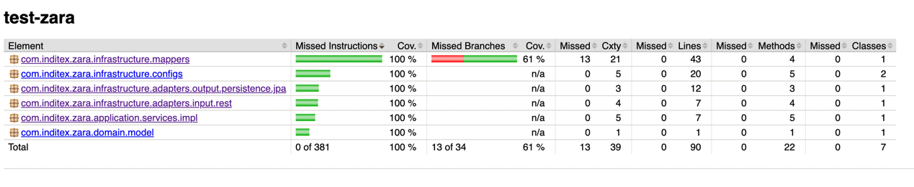

# 🛒 Zara Pricing API - Test Técnico

Microservicio Spring Boot que determina el precio final de productos aplicando reglas de prioridad sobre tarifas temporales, con arquitectura hexagonal y base de datos H2 en memoria.

# 🚀 Quick Start

### 1. Clonar repositorio
```bash
git clone https://github.com/miguelsotobaez/test-zara.git && cd test-zara
```

### 2. Iniciar la aplicación (requiere Maven 3.8+ y Java 21)
```bash
mvn spring-boot:run
```

### 3. Probar endpoint de ejemplo
```bash
curl "http://localhost:8080/api/v1/rest/prices/final-price?date=2020-06-14-15.00.00&productId=35455&brandId=1"
```

## 🚀 Tecnologías Utilizadas

### **Spring Boot 3** 
_El core del proyecto_  
Motor principal que provee autoconfiguración, gestión de dependencias y entorno embebido. Simplifica el desarrollo con:
- Auto-configuración de beans
- Embedded Tomcat server
- Gestión simplificada de propiedades

### **Spring Web** 
_Capa RESTful_  
Responsable de exponer y manejar endpoints HTTP con:
- Anotaciones `@RestController` y `@RequestMapping`
- Soporte para content negotiation (JSON/XML)
- Manejo automático de serialización/deserialización

### **Spring Data JPA** 
_Capa de persistencia_  
Abstracción sobre JPA/Hibernate para operaciones CRUD con:
- Repositorios automáticos (`JpaRepository`)
- Query methods (`findBy...`)
- Transacciones declarativas (`@Transactional`)

### **H2 Database** 
_Almacenamiento en memoria_  
Base de datos relacional embedida ideal para pruebas con:
- Inicio rápido (sin configuración externa)
- Consola web interactiva (/h2-console)
- Compatibilidad con SQL estándar

### **Lombok** 
_Productividad en código_  
Generación automática de código boilerplate mediante anotaciones:
- `@Data` → Getters/Setters/ToString
- `@Builder` → Patrón builder
- `@NoArgsConstructor` → Constructores

### **JUnit 5 + Mockito** 
_Suite de testing_  
Testing automatizado con:
- JUnit: Anotaciones `@Test`, `@BeforeEach`
- Mockito: Creación de mocks (`@Mock`, `@InjectMocks`)
- Assertions: `AssertJ` para fluent assertions

### **Maven** 
_Gestión de dependencias_  
Build automation y dependency management:
- Declaración de dependencias en pom.xml
- Gestión de ciclos de vida (compile, test, package)
- Plugins para Spring Boot y calidad de código

### **Java 21** 
_Lenguaje base_  
Version LTS con features clave:
- Records (`public record PriceResponse(...)`)
- Pattern Matching (switch expressions)
- Virtual Threads (preparado para concurrencia)

### **OpenAPI/Swagger v3** 
_Documentación interactiva_  
Generación automática de API docs con:
- Especificación OpenAPI 3.0
- UI interactiva en `/swagger-ui.html`
- Anotaciones `@Operation`, `@ApiResponse`

## 🗄️ Estructura de la Base de Datos

La aplicación utiliza una base de datos H2 en memoria que se inicializa automáticamente con:

- **Esquema inicial**: Definido en `schema.sql`
- **Datos de prueba**: Cargados desde `schema.sql`
- **Consola H2**: Accesible en `http://localhost:8080/h2-console` (Credenciales en `application.yml`)

```sql
-- Tabla de marcas
CREATE TABLE brands (
    id INT AUTO_INCREMENT PRIMARY KEY,
    name VARCHAR(50) NOT NULL
);

-- Tabla de precios
CREATE TABLE prices (
    id INT AUTO_INCREMENT PRIMARY KEY,
    brand_id INT NOT NULL,
    start_date TIMESTAMP NOT NULL,
    end_date TIMESTAMP NOT NULL,
    price_list INT NOT NULL,
    product_id INT NOT NULL,
    priority INT NOT NULL,
    price DECIMAL(10,2) NOT NULL,
    curr VARCHAR(3) NOT NULL,
    FOREIGN KEY (brand_id) REFERENCES brands(id)
);

-- Inserción de datos
INSERT INTO brands (id, brand_name) VALUES (1, 'ZARA');

INSERT INTO prices (brand_id, start_date, end_date, price_list, product_id, priority, price, curr) VALUES
(1, '2020-06-14 00:00:00', '2020-12-31 23:59:59', 1, 35455, 0, 35.50, 'EUR'),
(1, '2020-06-14 15:00:00', '2020-06-14 18:30:00', 2, 35455, 1, 25.45, 'EUR'),
(1, '2020-06-15 00:00:00', '2020-06-15 11:00:00', 3, 35455, 1, 30.50, 'EUR'),
(1, '2020-06-15 16:00:00', '2020-12-31 23:59:59', 4, 35455, 1, 38.95, 'EUR');
```

## 📌 Endpoints

## 1. Obtener precio final
**Método**: `GET`  
**URL**: `/api/v1/rest/prices/final-price`  
**Parámetros**:
- `date`: Fecha de consulta (formato `yyyy-MM-dd-HH.mm.ss`)
- `productId`: ID del producto (ej: `35455`)
- `brandId`: ID de la marca (ej: `1` para Zara)

**Ejemplo**:
```bash
GET localhost:8080/api/v1/rest/prices/final-price?date=2020-06-14-15.00.00&productId=35455&brandId=1
```

✅ Ejemplo de respuesta exitosa (200 OK):
```json
{
  "productId": 35455,
  "brandId": 1,
  "priceList": 2,
  "applicationDate": "2020-06-14T15:00:00",
  "finalPrice": 25.45,
  "currency": "EUR",
  "validFrom": "2020-06-14T15:00:00",
  "validTo": "2020-06-14T18:30:00"
}
```

❌ Ejemplo de error (404 Not Found):
```json
{
  "timestamp": "2023-11-15T10:00:00.000+00:00",
  "status": 404,
  "error": "Not Found",
  "message": "Price not found",
  "path": "/api/v1/prices/final-price"
}
```

## 🏗️ Arquitectura Hexagonal Mejorada

La aplicación sigue una arquitectura hexagonal (ports & adapters) con las siguientes mejoras:

### 🎯 Capas Principales

1. **🟢 Dominio (Core)**
   - `Price`: Entidad principal con reglas de negocio
   - `PriceDomainService`: Servicio de dominio para lógica de negocio pura
   - `PriceNotFoundException`: Excepción de dominio
   - Puertos de entrada/salida que definen contratos

2. **🔵 Aplicación**
   - `PriceService`: Puerto de entrada principal
   - `PriceServiceImpl`: Implementación que orquesta casos de uso
   - Manejo de transacciones y coordinación

3. **⚪ Infraestructura**
   - **API REST**:
     - `PriceController`: Adaptador de entrada REST
     - `PriceControllerApi`: Contrato OpenAPI
   - **Persistencia**:
     - `PriceJpaRepository`: Repositorio Spring Data JPA
     - `PriceRepositoryAdapter`: Adaptador del puerto de salida
   - **Configuración**:
     - `WebConfig`: Manejo flexible de formatos de fecha
     - Soporte para múltiples formatos: ISO, personalizado y alternativo

### 🔄 Flujo de Datos
```
[HTTP Request] → Controller → Application Service → Domain Service → Repository
                     ↑            ↑                      ↑              ↑
                  Adapters     Ports                  Domain         Adapters
```

### ✨ Mejoras Implementadas

1. **Simplificación de Formatos de Fecha**
   - Soporte para 3 formatos principales:
     - `yyyy-MM-dd HH:mm:ss` (estándar)
     - `yyyy-MM-dd-HH.mm.ss` (alternativo)
     - ISO_LOCAL_DATE_TIME (formato ISO)
   - Mensajes de error mejorados en español

2. **Separación Clara de Responsabilidades**
   - Lógica de negocio encapsulada en el dominio
   - Adaptadores desacoplados mediante puertos
   - Manejo de errores centralizado

3. **Testing Robusto**
   - Pruebas unitarias para cada capa
   - Cobertura completa de casos de uso
   - Tests de integración para flujos principales

# 🧪🔍 Pruebas y Cobertura con JaCoCo

## ▶️ Ejecutar pruebas con cobertura

```bash
mvn clean verify
```

Este comando realiza:

- **clean** 🧹  - Limpia compilaciones anteriores
- **verify** ✅ - Ejecuta todas las pruebas y genera reportes

---

## 📊 Reporte de Cobertura

JaCoCo genera un reporte detallado en:

```
target/site/jacoco/
```

### 📌 Abrir reporte

- **macOS/Linux**:
  ```bash
  xdg-open target/site/jacoco/index.html
  ```

- **Windows**:
  ```bash
  start target/site/jacoco/index.html
  ```

---

## 📈 Métricas principales

| Métrica               | Emoji | Descripción                            |
|------------------------|--------|----------------------------------------|
| Cobertura de líneas    | 📏     | Porcentaje de líneas ejecutadas        |
| Cobertura de ramas     | 🌿     | Decisiones lógicas cubiertas           |
| Métodos cubiertos      | ⚙️     | Métodos con pruebas                    |
| Complejidad            | 🧩     | Complejidad ciclomática                |


# Evidencia de los test 100% pasados


## ✉️ Contacto
📧 **Email**: [fe.galaz@gmail.com](fe.galaz@gmail.com)  
👔 **LinkedIn**: [Contactar](https://www.linkedin.com/in/felipe-galaz-b7358b91/)  
📅 **Versión**: 1.0.0 (2025)